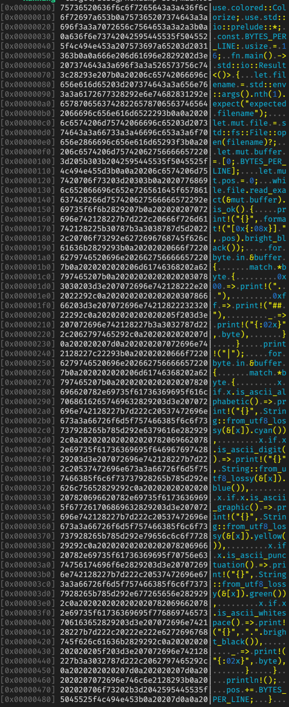

# hexdump

A simple hexdump clone with coloured output for everything but control characters.

## Usage

Build the executable

```shell
cargo build --release
```

Run the executable and pass in a filename:

```shell
./target/release/hexdump src/main.rs
```

The output should look like this (this is the output of the source file at the moment):


